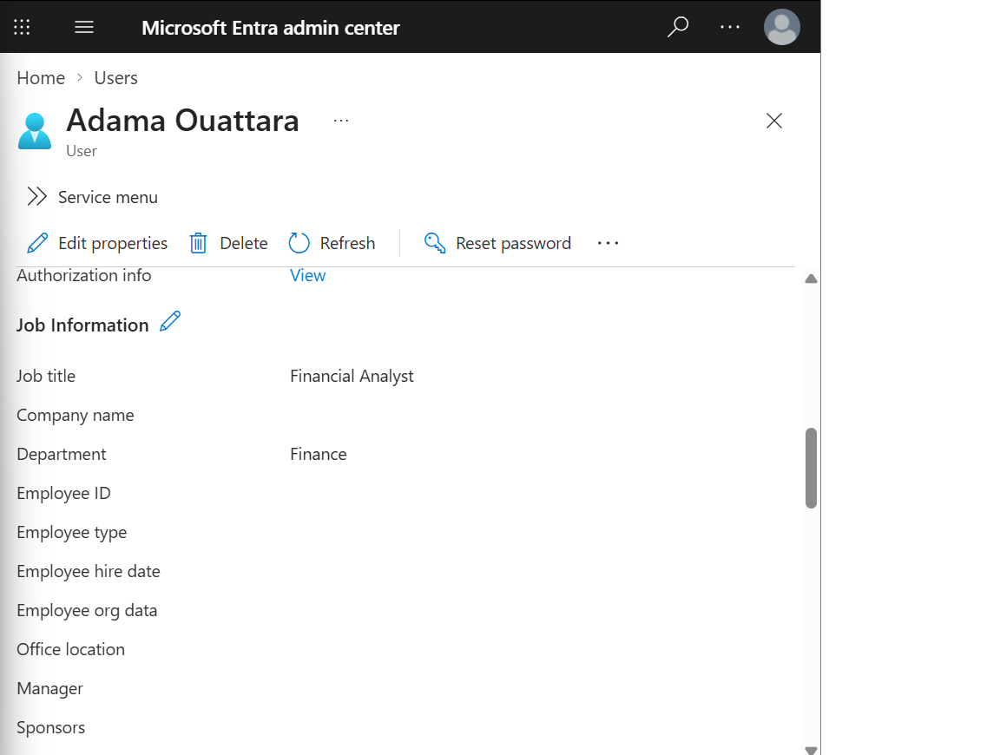
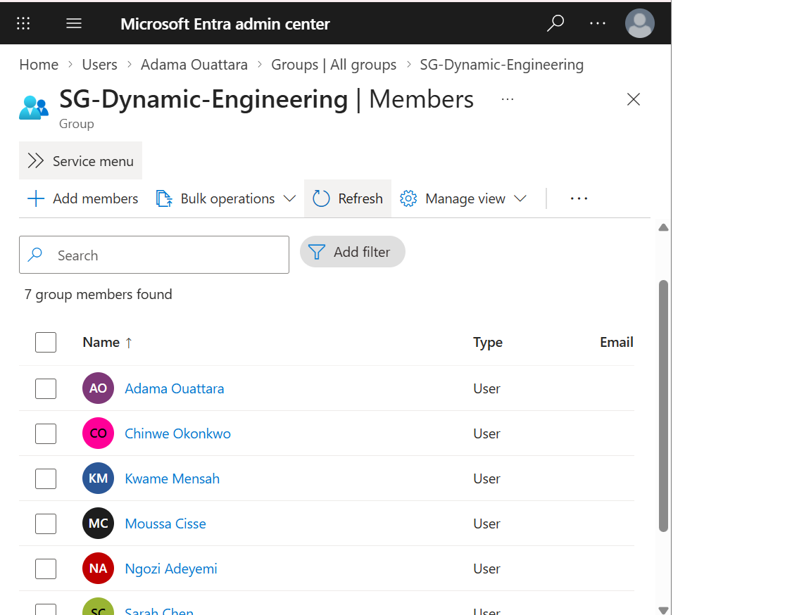
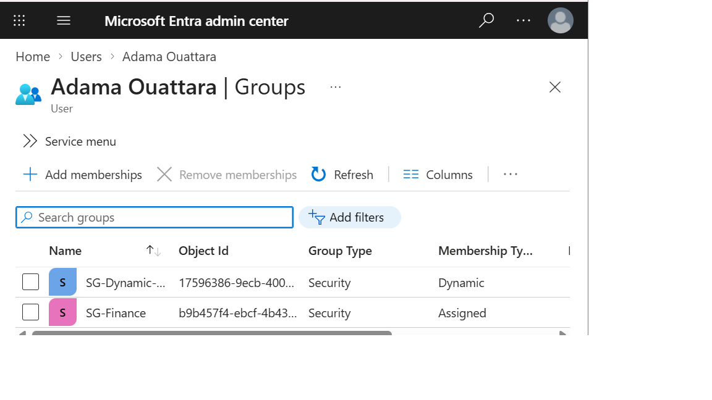

## Scenario 1 — Mover: dynamic group membership updates automatically on attribute change

**Policy:** SG-Dynamic-Engineering — dynamic membership rule `(user.department -eq "Engineering")`
**Date tested:** 2026-10-05
**Objective:** Demonstrates that moving an employee into a new department automatically updates their group membership with no manual group-add action, proving access reflects organizational reality without a ticket.

**Setup:**
- User: Adama Ouattara
- 12:46 10/5/2026 : Department = "Finance", not a member of SG-Dynamic-Engineering

**Expected result:** User automatically added to SG-Dynamic-Engineering after Department is changed to "Engineering", with no manual group edit.
**Actual result:** Department changed at [12:46 10/5/2026]. User appeared in SG-Dynamic-Engineering membership at [12:48] — approximately [2] minutes later, with no manual action taken on the group itself.

**Evidence:**

- [SG-Dynamic-Engineering-rule.txt](../policies/SG-Dynamic-Engineering-rule.txt) — exported dynamic membership rule

**Business takeaway:**
Access automatically follows organizational data instead of depending on someone remembering to file a group-change ticket — removing a common source of access drift where employees keep old-team access long after they've moved on.

---

## Scenario 1 — Mover: dynamic group membership updates automatically on attribute change

**Policy:** SG-Dynamic-Engineering — dynamic membership rule `(user.department -eq "Engineering")`
**Date tested:** 2026-10-05
**Objective:** Demonstrates that moving an employee into a new department automatically updates their group membership with no manual group-add action, proving access reflects organizational reality without a ticket.

**Setup:**
- User: Adama Ouattara
- Starting state: Department = "Finance", not a member of SG-Dynamic-Engineering

**Expected result:** User automatically added to SG-Dynamic-Engineering after Department is changed to "Engineering", with no manual group edit.
**Actual result:** Department changed at 12:46 PM EDT on 2026-10-05. User appeared in SG-Dynamic-Engineering membership at 12:48 PM EDT — approximately 2 minutes later, with no manual action taken on the group itself.

**Evidence:**

- [SG-Dynamic-Engineering-rule.txt](../policies/SG-Dynamic-Engineering-rule.txt) — exported dynamic membership rule

**Business takeaway:**
Access automatically follows organizational data instead of depending on someone remembering to file a group-change ticket — removing a common source of access drift where employees keep old-team access long after they've moved on.

---
